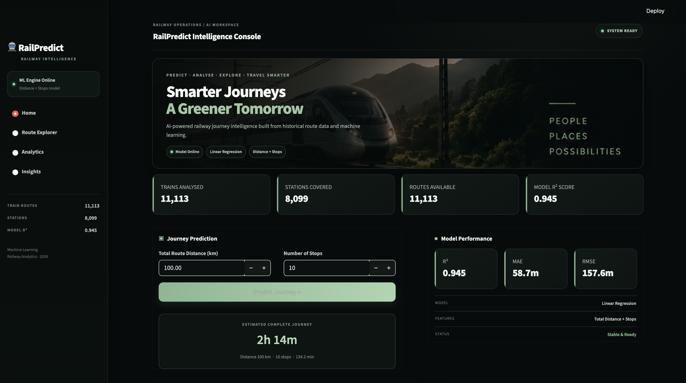
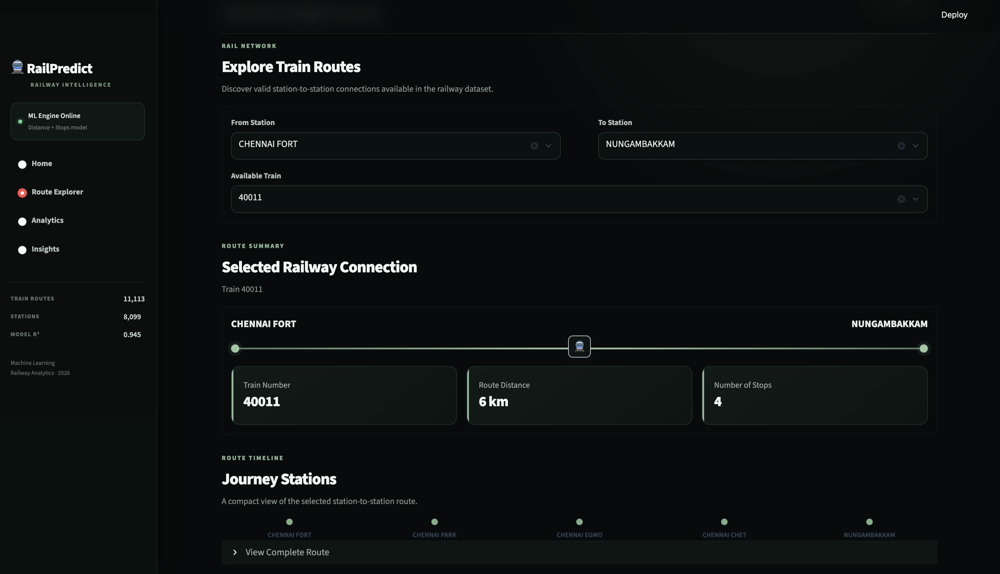
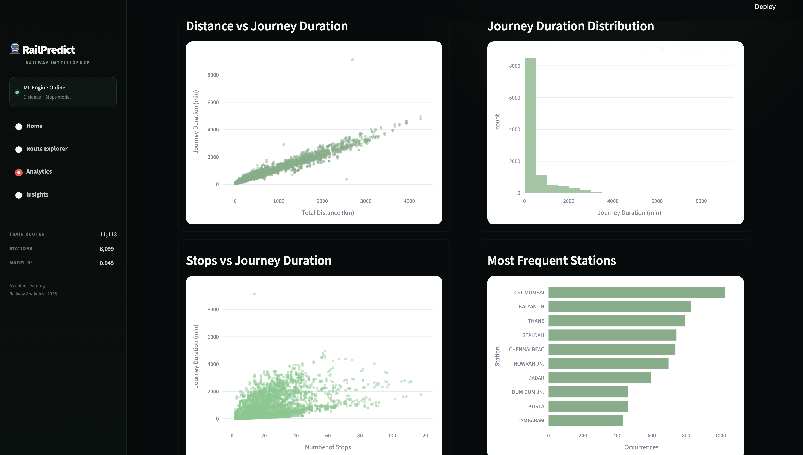
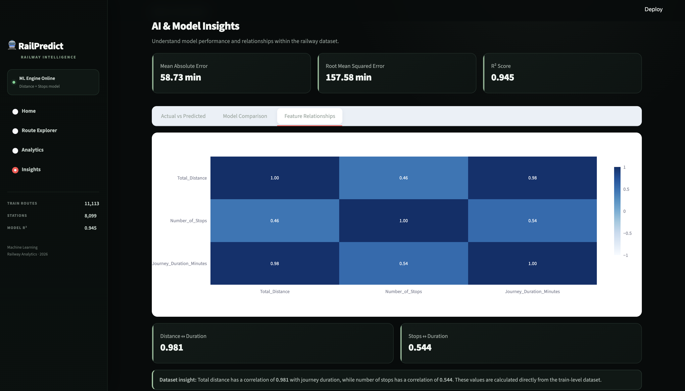
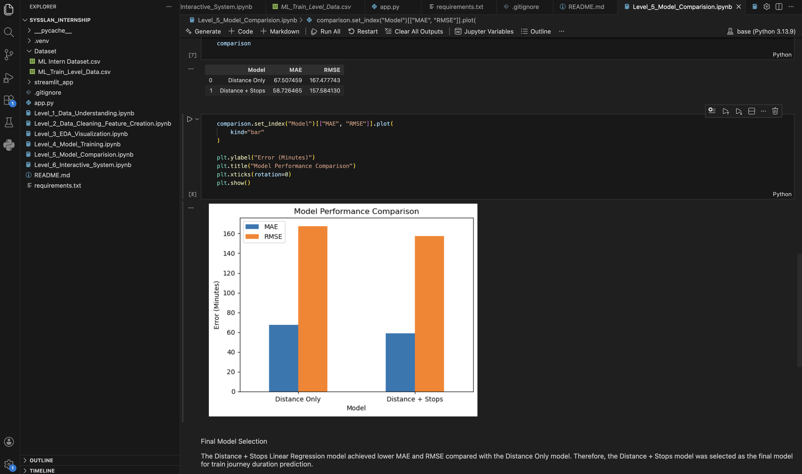

<div align="center">

# 🚆 RailPredict

### Machine Learning-Based Train Journey Time Prediction System

**From raw railway data → machine learning → interactive predictions**

<br>










<br>

**An end-to-end Machine Learning project developed during my  
Machine Learning Internship at Sysslan IT Solutions.**

</div>

---

## 🌟 About RailPredict

**RailPredict** is an end-to-end Machine Learning system designed to predict the **total duration of a train journey** using important journey characteristics.

The system uses:

> 📏 **Total Distance** + 🚉 **Number of Stops** → 🤖 **Machine Learning Model** → ⏱️ **Predicted Journey Duration**

The project covers the complete ML lifecycle — starting from raw railway schedule data and progressing through preprocessing, feature engineering, exploratory data analysis, model training, evaluation, comparison, and an interactive **Streamlit dashboard**.

---

## 🎯 Project Objective

The objective of RailPredict is to build a Machine Learning system that learns patterns from historical train journey data and estimates journey duration using:

| 📥 Input Feature | Description |
|---|---|
| 📏 `Total_Distance` | Total distance travelled by the train |
| 🚉 `Number_of_Stops` | Number of stops in the journey |

### 🎯 Target

```text
Journey_Duration_Minutes
```

---

# 🖥️ RailPredict Dashboard

## 🏠 Journey Prediction

Enter the **total journey distance** and **number of stops**, and RailPredict estimates the duration of the complete train journey.


---

## 🗺️ Route Explorer

Explore available train routes between selected stations.

The Route Explorer provides:

- 🚉 Station sequence
- 🚆 Available trains
- 🕐 Arrival information
- 🕐 Departure information
- 📏 Route distance
- 📍 Number of stops


---

## 📊 Interactive Analytics

RailPredict includes interactive visualizations for exploring relationships and patterns within the train journey dataset.


---

## 💡 Data Insights

The Insights dashboard presents important observations derived from the processed train journey data.


---

# 🧠 Machine Learning Model

## ⚙️ Algorithm

The final prediction system uses:

### **Linear Regression**

The model learns the relationship between:

```text
Total Distance
      +
Number of Stops
      ↓
Linear Regression
      ↓
Journey Duration
```

---

## 📈 Model Performance

<div align="center">

| 📊 Metric | 🎯 Result |
|---|---:|
| **MAE** | **≈ 58.73 minutes** |
| **RMSE** | **≈ 157.58 minutes** |
| **R² Score** | **≈ 0.945** |

</div>

### What does this mean?

**MAE (Mean Absolute Error)** indicates that predictions differ from the actual journey duration by approximately **58.73 minutes on average**.

The **R² score of approximately 0.945** indicates that the selected features explain a large proportion of the variation in journey duration within this dataset.

---

# ⚔️ Model Comparison

Two Linear Regression configurations were tested.

| 🤖 Model | 📥 Features | MAE ↓ | RMSE ↓ |
|---|---|---:|---:|
| Model 1 | Distance Only | 67.51 | 167.48 |
| 🏆 Model 2 | Distance + Stops | **58.73** | **157.58** |

The **Distance + Stops** configuration produced lower MAE and RMSE and was therefore selected as the final model for RailPredict.


---

# 🔬 Complete Machine Learning Workflow

The project was developed through **six internship levels**.

```text
📂 Raw Train Data
        ↓
🔍 Data Understanding
        ↓
🧹 Data Cleaning
        ↓
⚙️ Feature Engineering
        ↓
📊 Exploratory Data Analysis
        ↓
🧠 Model Training
        ↓
📏 Model Evaluation
        ↓
⚔️ Model Comparison
        ↓
🏆 Final Model Selection
        ↓
🖥️ Streamlit Application
```

---

## 1️⃣ Data Understanding

The original train dataset was explored to understand its structure and quality.

Tasks included:

- Dataset size and column inspection
- Train-wise starting and ending stations
- Distance and stop statistics
- Missing-value analysis
- Duplicate detection
- Incorrect/inconsistent-value checks

---

## 2️⃣ Data Cleaning & Feature Engineering

The raw station-level data was cleaned and transformed into a train-level Machine Learning dataset.

Important features created:

```text
Total_Distance
Number_of_Stops
Journey_Duration_Minutes
```

Arrival and departure information was processed to calculate the duration of complete train journeys.

---

## 3️⃣ Exploratory Data Analysis

EDA was performed to understand relationships between journey characteristics.

Analysis included:

📏 **Distance vs Journey Duration**

🚉 **Stops vs Journey Duration**

🔥 **Correlation Analysis**

📊 **Train-wise Stop Analysis**

---

## 4️⃣ Model Training

The Machine Learning dataset was divided into:

```text
80% → Training Data
20% → Testing Data
```

A **Linear Regression** model was trained using:

```python
X = ["Total_Distance", "Number_of_Stops"]
y = "Journey_Duration_Minutes"
```

---

## 5️⃣ Model Comparison

Two models were evaluated:

### Model 1
```text
Distance → Journey Duration
```

### Model 2
```text
Distance + Stops → Journey Duration
```

The multi-feature model achieved lower prediction errors and was selected as the final model.

---

## 6️⃣ Interactive ML System

The final model was integrated into **RailPredict**, an interactive Streamlit application.

The application combines:

**Prediction + Route Exploration + Analytics + Insights**

into one dashboard.

---

# 🛠️ Technology Stack

<div align="center">

| Category | Technologies |
|---|---|
| 💻 Programming | Python |
| 🧹 Data Processing | Pandas, NumPy |
| 🤖 Machine Learning | Scikit-learn |
| 📈 ML Algorithm | Linear Regression |
| 📊 Visualization | Plotly, Matplotlib |
| 🌐 Web Application | Streamlit |
| 📓 Development | Jupyter Notebook, VS Code |
| 🔧 Version Control | GitHub |

</div>

---

# 📁 Project Structure

```text
RailPredict-Train-Journey-Prediction/
│
├── 📂 Dataset/
│   ├── ML Intern Dataset.csv
│   └── ML_Train_Level_Data.csv
│
├── 📂 screenshots/
│   ├── home-prediction.png
│   ├── route-explorer.png
│   ├── analytics.png
│   ├── insights.png
│   └── model-comparison.png
│
├── 📓 Level_1_Data_Understanding.ipynb
├── 📓 Level_2_Data_Cleaning_Feature_Creation.ipynb
├── 📓 Level_3_EDA_Visualization.ipynb
├── 📓 Level_4_Model_Training.ipynb
├── 📓 Level_5_Model_Comparision.ipynb
├── 📓 Level_6_Interactive_System.ipynb
│
├── 🚆 app.py
├── 📋 requirements.txt
├── 📝 README.md
└── ⚙️ .gitignore
```

---

# 🚀 Run RailPredict Locally

### 1️⃣ Download or clone the repository

```bash
git clone https://github.com/Rozina-13/RailPredict-Train-Journey-Prediction.git
```

Move into the project directory:

```bash
cd RailPredict-Train-Journey-Prediction
```

### 2️⃣ Create a virtual environment

```bash
python -m venv .venv
```

### 3️⃣ Activate it

**macOS / Linux**

```bash
source .venv/bin/activate
```

**Windows**

```bash
.venv\Scripts\activate
```

### 4️⃣ Install dependencies

```bash
pip install -r requirements.txt
```

### 5️⃣ Launch RailPredict 🚆

```bash
streamlit run app.py
```

The application will open in your browser.

---

# ⚠️ Project Scope

RailPredict's Machine Learning model predicts the duration of a **complete train journey** using:

```text
Total Distance + Number of Stops
```

The **Route Explorer** analyzes station-to-station route information.

Route Explorer results should therefore not be interpreted as separate station-to-station Machine Learning journey-duration predictions.

---

# 🔮 Future Enhancements

RailPredict can be extended with:

- 🌦️ Weather information
- 🚦 Operational and traffic conditions
- ⏳ Historical delay information
- 🤖 Advanced regression algorithms
- 🔍 Model explainability
- ☁️ Cloud deployment
- 🔄 Real-time railway information
- 📈 Additional journey-related features

---

# 🎓 Internship Project

<div align="center">

### Machine Learning Internship  
### **Sysslan IT Solutions**

This project provided practical experience across the complete Machine Learning lifecycle:

**Data → Analysis → Features → Machine Learning → Evaluation → Application**

</div>

---

# 👩‍💻 Developed By

<div align="center">

## **Rozina Sheereen**

🎓 Final-Year B.Sc. Artificial Intelligence & Machine Learning Student

💡 Aspiring **AI / Generative AI Engineer**

<br>

[](https://www.linkedin.com/in/rozina13)
[](https://github.com/Rozina-13)

</div>

---

<div align="center">

### 🚆 RailPredict

**Turning railway route data into intelligent journey-time predictions.**

⭐ If you found this project interesting, consider starring the repository!

</div>
